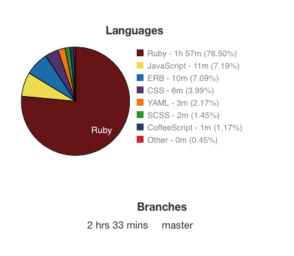

# **Tic Tac Toe App**

---

This App was developed as an assignment to demostrate the usage of **OOP** using **Ruby on Rails**.

### Specifications

> Write your own tic-tac-toe application. The application must be object orientated and tested. This is an open-ended exercise to write tested and testable code. Don’t spend more than three hours.

### Descrption

The app is based on the famous game **Tic Tac Toe**. If the game is played well there will be always a draw. 

In this application was used **ActionCable** a feature from the newest **Rails 5**  which allow us to use a websocket. 
This approach integrate also the usage of **Redis**. 
The reason behind this method is becasue the app is thought to be played from 2 players. The idea is that we use a channale to broadcast message in real-time and everyone which is on lisneting wiil then receive the message. 
In the app case we have 2 players playing via two different browser pages and both players see the game grid. When a player take a move, in our case putting an X or O inside the grid. This move is broadcasteed to the second player which see in real-time the move. Then the player which has turn does the same and then again the move is broadcasted.
The methodology allow us to make this possible.  

### Requirements

The next requirments are mandatory to be present on the local machine to be able to run the app correctly

- Ruby 2.5.1 
- Rails 5.2.1
- PostgresSQL
- Redis

### Run The App

1. Clone the repo to desired folder
2. Run in terminal **bundle install**
3. Make sure **PSQL** and **Redis** are running
4. Run in terminal **rails db:create** and then **rails db:migrate**
5. Run **rails s** to run the application
6. Open the browser at **localhost:3000** to be able to play open anothe browser at the same URL and enjoy playing

### Testing

The app was tested and the results as next

````bash
GridsController
  GET Index
    renders the index template

Game
  Start
    Player1's opponent should be Player2 after method start
  Withdraw
    Should be called broadcast(action:withdraw) after withdraw
  Opponent_for
    opponent_for( player1 ) should return player2
  Take_turn
    should be called broadcast(action:take_turn) after take_turn
  New_game
    should be called broadcast(action:new_game) after new_game

Match
  Create
    Matches's value should be player1 after only one time call of create
    Should call Game.start after two time call of create
    After two times call of create
      Matches's value should be nil at create's two time call
  Remove
    When same id remove,
      Matches's value should be nil
    When other id remove,
      Matches's value should be not nil
  Clear_all
    'matches's value should be nil


Finished in 0.11638 seconds (files took 2.15 seconds to load)
12 examples, 0 failures
````


### Statistics

The application was done in within 3h as documnted in the next statistics




